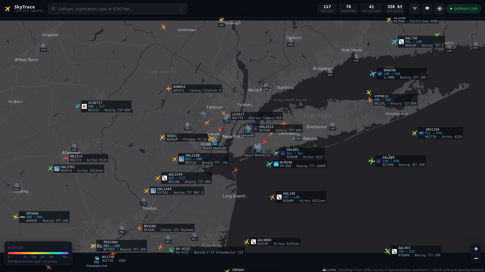
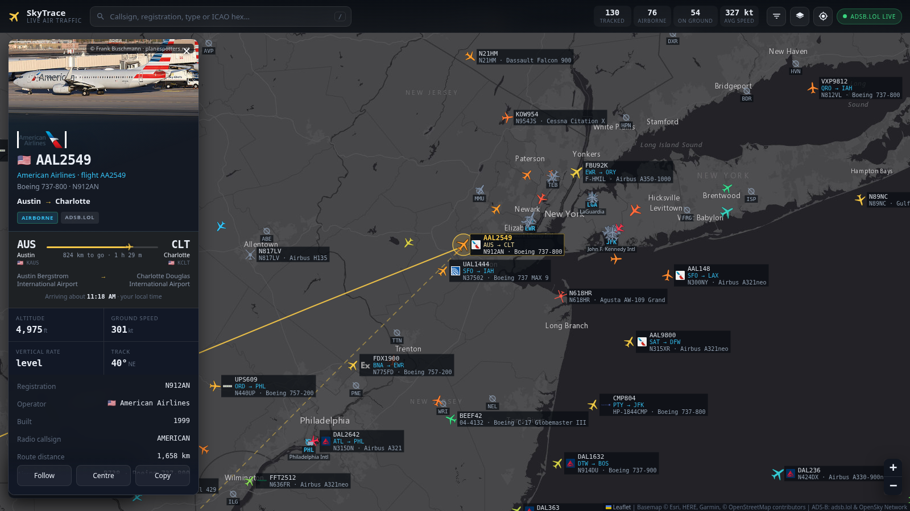
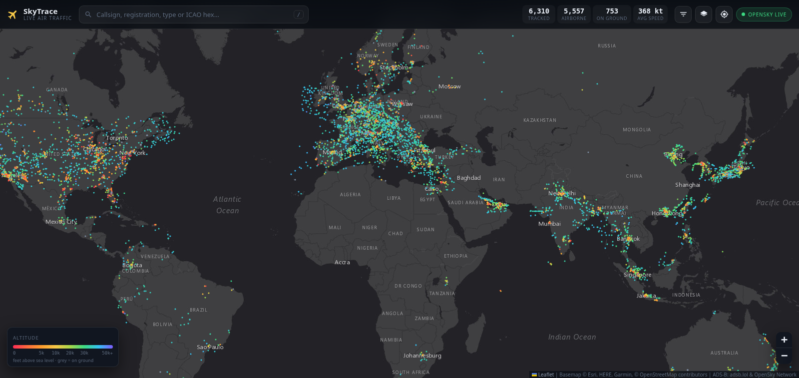
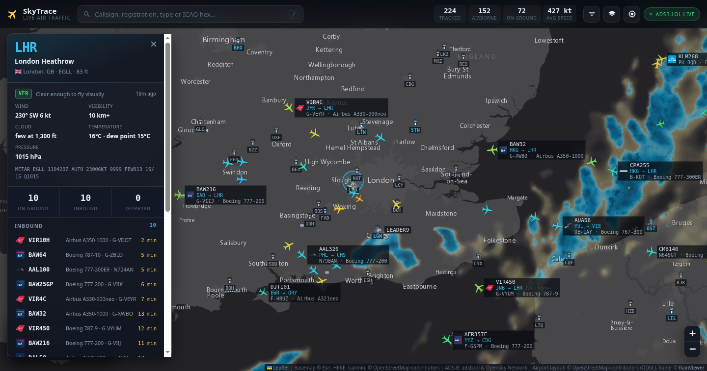
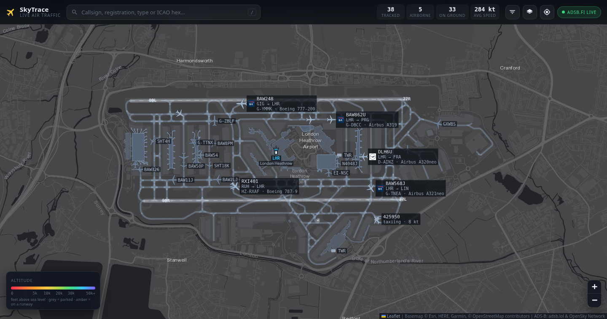
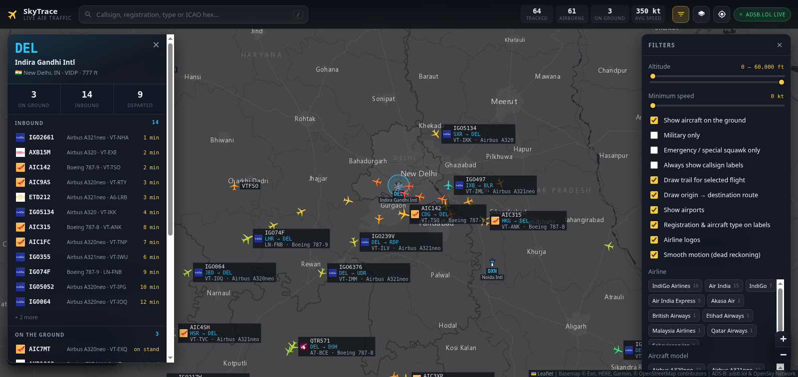

# SkyTrace — live worldwide flight tracker

A Flightradar24-style live map of air traffic, built on open ADS-B data. Aircraft
positions update continuously, worldwide, with no API keys and no npm
dependencies.

```bash
npm start          # then open http://localhost:8787
```

That is the whole setup. Node 18+ is the only requirement.



*New York approach: airports with their IATA codes and names, and every
aircraft labelled with its airline logo, callsign, route, tail number and
model.*



*Selecting a flight: a photograph of that airframe, the airline's logo, its
route with progress and arrival estimate, operator and build year.*

## What it does

- **Live traffic worldwide.** Pan or zoom anywhere and the map loads the traffic
  in view — roughly 10 000 aircraft are airborne at any moment.
- **Smooth motion.** Between server polls each aircraft is dead-reckoned from its
  last reported position, track and ground speed, so targets glide instead of
  hopping every few seconds.
- **Real airline logos and real photographs**, not drawn icons. Logos appear on
  the map labels, in search results, in the hover card and in the detail panel;
  the panel also shows an actual photograph of that specific airframe, credited
  to the photographer and linking back to their page.
- **Search for an airport by name or code.** Type `Coimbatore`, `CJB`, `VOCB`,
  `Madurai` or `London` and the airports come back first — city, country,
  and how much of their traffic is already on screen. Picking one flies there
  and opens its live panel. It works from the bundled airport table, so it
  answers whether or not that part of the world is currently loaded; flights
  into and out of a matched airport are listed underneath.
- **Search by route.** The search box takes a leg as well as a callsign:
  `DEL-BOM`, `LHR > JFK`, `to LHR`, `from DEL`, or plain English —
  `London to New York` resolves to twelve London airports and three New York
  ones. Results show each flight's origin and destination, and **Show only
  these** narrows the map itself to that leg until you clear it. Ordinary
  searches are unaffected: `AIR INDIA`, `A320-200` and `B737-800` are not read
  as routes.
- **Flights that have already landed.** Select an aircraft and the panel lists
  the legs it has flown in the last 30 hours — `EGLL → KBOS 07:40 PM–02:34 AM,
  6h 55m` — and clicking one draws the path it actually flew, green where it
  started and red where it stopped, coloured by altitude like a live trail.
  An airport panel does the same for everything that landed there. This comes
  from OpenSky's archive rather than the live feeds, so it needs credentials.
- **Nothing disappears quietly.** Whenever anything is hiding or dimming
  aircraft — a filter chip, a route search, an altitude band, ground traffic
  switched off — a bar at the bottom says exactly what and how many
  (`Showing 0 of 548 · 1 airline · ground traffic hidden`), with **Show all**
  to undo every one of them at once. Filter choices are remembered between
  sessions, so without this a chip clicked last week could silently empty
  today's map.
- **Matches are highlighted on the map.** Anything a search matches gets a
  cyan ring and keeps its label; everything else drops into the background.
  It applies to every search, not just routes — `BAW` rings all the British
  Airways traffic, `A350` every A350, `G-XWB` the one airframe. `Esc` clears
  the box and the highlight together.
- **Most watched.** A live board of the flights people currently have open,
  ranked by how many are looking. It counts the viewers of *this* instance —
  you, and anyone else with it open on your network — because there is no
  public feed of what the world is watching. Each tab heartbeats the flight it
  has selected; the server holds nothing but a hex and a timestamp in memory
  and forgets a viewer within a minute of it going quiet. No history, no
  identity, nothing written to disk.
- **Weather.** Two kinds, both free and keyless. *Precipitation radar* is a
  global overlay you switch on under Map style — where the rain actually is,
  refreshed every few minutes, with the frame's own timestamp shown so you can
  see how current it is. *Airport weather* appears at the top of any airport
  panel: the METAR decoded into wind, visibility, cloud base, temperature,
  dew point and pressure, headed by the flight category — `VFR`, `MVFR`, `IFR`
  or `LIFR` — with the raw observation underneath for anyone who reads them.
- **The airport itself, drawn underneath.** Zoom past 12 and the grey blank
  where the airport should be becomes the real thing: every runway with its
  designators painted on the correct ends and a dashed centreline, the whole
  taxiway network, aprons, terminals, hangars, and — past zoom 16 — the
  numbered stands. It comes from OpenStreetMap via Overpass, so a jet you can
  see taxiing is on a taxiway you can see too. Each airport is fetched once
  and cached on disk (`.cache/layouts/`), so it costs one request in its
  lifetime and nothing after a restart. Toggle it under Filters.
- **Airports on the map.** 4,573 large and medium airports, each marked by a
  little control tower standing on its position, with its IATA code and (when
  you are close enough) its full name.
- **Click an airport for its live traffic.** The tower — or its code label —
  opens a panel showing what is inbound with minutes to landing, what is
  **moving on a runway or taxiway**, what is **standing** on the field, and
  what has just departed, each row with the airline's logo, aircraft model and
  tail number. Clicking a row jumps to that flight. While an airport is open
  its own airspace is polled directly, so the list keeps updating even if you
  pan the map somewhere else.
- **The field itself, not just the sky.** Zoom into an airport and speed on the
  ground is colour-coded: amber for an aircraft on its take-off roll or landing
  rollout, pale blue for taxiing, grey for parked. Anything taxiing keeps its
  full label; parked aircraft get a compact chip each, so a stand-by-stand
  apron stays readable instead of collapsing into one grey blob. Airport
  surveillance towers and service vehicles broadcast on the same frequencies —
  they are drawn as boxes and kept out of the flight lists.
- **Filter by airline, model, airport or class.** The filter panel builds chips
  from what is actually in view — `Ryanair 80`, `Airbus A320neo 40`, `LHR 6`,
  `CDG 3`, `Heavy 105`, `Military 1` — and clicking one narrows the map to it.
  The **Airport** chips are the origins and destinations of the flights in
  view, so `LHR` gives you everything arriving at *or* leaving Heathrow;
  selecting one also makes the remaining routes resolve faster. Combine them
  freely; the counts update as traffic changes. Hover one for its ICAO code, city, country and elevation.
  The data is bundled with the app, so it costs nothing and works offline.
- **Every aircraft identified in three lines** — callsign, route, then the
  airframe itself:

  ```
  ICE56K                 AAL780                 N258X
  JFK → KEF              PHX → IND              N258X · Dassault Falcon 7X
  TF-ICL · Boeing 737 MAX 8    N803AL · Boeing 787-8
  ```

  Tail number, manufacturer and model, straight on the map — no clicking.
- **Every airliner is labelled with where it started and where it ends** —
  `EJU19PN` / `BCN → EDI` — directly on the map, no clicking required. Routes
  for the flights in view are resolved in the background and cached, and in
  busy airspace the labels go to the flights whose route is known (a bare
  registration is not worth the pixels). Overlapping labels are dropped so the
  map stays readable, and `L` forces labels on for everything.
- **Where it came from and where it lands.** Selecting a flight resolves its
  route: departure and arrival airport names, their cities and countries, ICAO
  and IATA codes, total route distance, how far is left, and an estimated
  arrival time. The great circle is drawn on the map — solid for the distance
  already flown, dashed for what remains — with a labelled pin at each airport.
- **Click any aircraft** for a photo of the airframe, the airline's logo,
  callsign, airline, registered operator, year built, registration, ICAO type and model, country of registration, altitude
  (barometric and geometric), ground speed, vertical rate, track, squawk,
  signal age and a photo of the actual airframe where one exists.
- **Hover any aircraft** for a quick tooltip with its route (`LHR → JFK`),
  operator, type, altitude and speed.
- **Follow mode** keeps the map locked on one flight, and keeps polling that
  aircraft directly even after it leaves the viewport.
- **Search** by callsign, registration, ICAO hex, type code or airline name.
- **Filters** for altitude band, minimum speed, on-ground traffic, military
  only, and emergency / special squawks only.
- **Trails** showing where the selected flight has been (up to 40 minutes).
- **Five basemaps** — dark, light, satellite, streets, terrain — all keyless.
- Emergency squawks (7500 hijack, 7600 radio failure, 7700 general emergency)
  pulse red on the map and are called out in the detail panel.

Colours encode altitude on a deliberately non-linear ramp: most terminal-area
traffic sits below 10 000 ft, so the low bands get most of the colour range.
Grey means on the ground, green means military.

### Keyboard

| Key | Action |
| --- | --- |
| `/` | focus search |
| `Esc` | deselect / close |
| `F` | follow the selected flight |
| `L` | force callsign labels on for every aircraft |

Clicking empty map closes whichever panel is open. An aircraft directly under
the pointer always wins over a tower behind it — at a busy airport, aim for the
tower's cab or its code label.

Ground coverage differs between the two feeds — at Delhi, adsb.fi hears the
traffic on the apron and adsb.lol hears none of it — so any view of roughly a
single airport (under 45 NM) asks **both** feeds and merges the answers, and
the badge reads `both feeds live`. A feed sitting in a rate-limit cooldown is
skipped rather than waited for, so one slow feed never holds up the other.

The map position and selected flight live in the URL hash, so any view is a
shareable link: `#51.47/-0.45/10/e8040d`.



*The whole-world view with OpenSky credentials: every aircraft airborne right
now, refreshed every 27 seconds.*



*Precipitation radar over south-east England, with Heathrow's own observation
in the panel: VFR, 230° at 6 kt, 10 km+, few cloud at 1,300 ft.*



*Heathrow at zoom 14: both runways with their designators, the taxiway
network and the terminals drawn from OpenStreetMap, with live traffic on top —
amber on a runway, pale blue taxiing, grey parked.*



*Delhi opened from its tower: inbound flights with minutes to landing, what is
on the ground, and filter chips built from the traffic actually in view.*

## Where the data comes from

Two free ADS-B networks, picked per request by how much of the world you are
looking at:

| Feed | Used for | Gives us |
| --- | --- | --- |
| [adsb.fi](https://github.com/adsbfi/opendata) | preferred point feed | registration, ICAO type, **manufacturer and model**, **registered operator**, **year built**, squawk, category, military flag |
| [adsb.lol](https://api.adsb.lol/docs) | the other point feed — the two alternate | registration, ICAO type, squawk, category, military flag |
| [OpenSky Network](https://opensky-network.org/apidoc/rest.html) | views too wide to tile, up to the whole world | position, altitude, speed, track, country of registration |
| your own receiver | everything it can hear, if you have one | the same, with no quota and a one-second refresh |

The two point feeds are interchangeable, so the server alternates between them
— sending each request to whichever can answer soonest. That roughly doubles
the request budget, which is what makes wide tiled sweeps practical.

This gives three tiers of freshness, and the status badge always says which one
you are looking at:

| View | Feed | Refresh | Detail |
| --- | --- | --- | --- |
| Regional (within ~250 NM) | one circle from adsb.fi or adsb.lol | 5 s | full |
| Country-sized (2–4 tiles) | tiled point feeds | ~12 s | full |
| Continental (up to 6–8 tiles) | tiled point feeds | ~12–25 s | full |
| Wider than that | OpenSky | 27 s with credentials; a 5-minute snapshot without | position only |

"Full" detail means registration, manufacturer, model, operator and build year —
only the point feeds carry those, so tiling is preferred wherever it is
affordable. With credentials, OpenSky also acts as the safety net: if a tiled
sweep comes back incomplete, the plainer but complete OpenSky picture is used
instead.

The refresh interval is not fixed — the server measures what the upstream will
actually tolerate and reports the pace it settled on, which the badge shows
(`ADS-B wide · 38s`).

Positions alone do not say where a flight started or where it is going, so two
more keyless services fill that in — looked up per aircraft on selection or
hover, never for a whole viewport:

| Service | Gives us |
| --- | --- |
| [adsbdb.com](https://www.adsbdb.com/) | callsign → airline and origin / destination airports with name, city, country and coordinates; ICAO24 → operator, manufacturer, model and photo |
| [hexdb.io](https://hexdb.io/) | fallback route lookup, and airport metadata by ICAO code |
| [Overpass](https://overpass-api.de/) | airport ground layout from OpenStreetMap — runways, taxiways, aprons, terminals, stands (ODbL) |
| [RainViewer](https://www.rainviewer.com/) | global precipitation radar tiles; the server caches only the frame index, the tiles load straight from their CDN |
| [aviationweather.gov](https://aviationweather.gov/) | METARs from NOAA, already parsed — wind, visibility, cloud, temperature, pressure, flight category |
| [planespotters.net](https://www.planespotters.net/photo/api) | a photograph of the specific airframe, with the photographer's name and a link to the photo |

Airline logos come straight from two keyless image CDNs — [kiwi.com](https://images.kiwi.com/)
for the square marks, falling back to [daisycon](https://images.daisycon.io/)
for the carriers kiwi does not cover (mostly cargo airlines). They are ordinary
`` loads from the browser, so they never touch this server and never count
against any API budget.

Route lookups are cached for 12 hours (a callsign flies the same route every
day), unknown callsigns for 45 minutes, and transient failures for seconds — so
a busy session makes very few upstream calls. Filling a fresh viewport costs a
few hundred lookups once; after that the labels appear instantly.

### Staying inside the rate limits

Every one of these feeds is free, and all four will rate-limit you. The server
paces each upstream independently, with concurrent callers queued rather than
fired in parallel, and the gap between requests is **adaptive**: a `429` widens
it, a success narrows it back towards the floor, and only four refusals in a row
pause that provider (for 30 s). A request that cannot be served falls back to
the other feed, or returns the last good snapshot rather than blanking the map.
`GET /api/health` reports the pace each upstream has settled on.

The pacing comes from measurement, not guesswork:

- **adsb.lol** sustains roughly **one request every two seconds** (a 1.1 s
  cadence gets 429s after the third request), so requests are spaced 2.5 s
  apart to begin with, then adapted from there. That is why a wide sweep may
  come back as partial coverage once and complete on the next pass — it is
  finding the sustainable rate, and the client keeps showing the aircraft it
  already had meanwhile. The pace also decides how widely a view can be tiled:
  the server only starts a sweep it can finish before the result would be
  stale, so when adsb.lol is slow a wide view quietly uses OpenSky instead.
  Tiling is capped at 8 circles without OpenSky credentials and 4 with them,
  since OpenSky is then live and cheaper.
- **OpenSky anonymous** allows about **400 credits per day** and a whole-world
  request costs 4, so continuous polling is impossible on the free tier. Rather
  than fail, the world view becomes a snapshot refreshed every 5 minutes, which
  does fit the quota; the badge says *snapshot N min old* so you are never
  misled about how fresh it is. Credentials make it live.

If the badge goes amber and says *feed busy*, an upstream is in cooldown — zoom
in (regional views use adsb.lol, which has plenty of headroom) and it clears
itself. Note that hammering these APIs earns a longer penalty than the
documented limit suggests, so give it a minute rather than reloading
repeatedly.

`server.js` normalises both into one aircraft shape, caches responses (3 s for
adsb.lol, 12 s for OpenSky) and collapses concurrent identical requests, so ten
open tabs cost the same upstream traffic as one. If one feed fails the other is
tried, and a stale cached snapshot is served rather than blanking the map.

Registration country, airline names, aircraft model names, emitter categories
and squawk meanings are resolved locally from the tables in `public/data.js` —
no extra network calls.

### Is there a free live feed with no rate limit?

Not on the public internet — every free ADS-B API throttles, because they are
funded by volunteers. What this app does about it, in order of effectiveness:

1. **Alternate between two feeds.** adsb.fi and adsb.lol serve the same data,
   so using both roughly doubles the headroom. This is on by default.
2. **Bundle what does not change.** Airports, airline codes, aircraft types and
   registration-country blocks are shipped with the app, so identifying an
   aircraft or drawing an airport never costs a request. Logos and photos load
   straight from image CDNs in the browser, bypassing the server entirely.
3. **Cache aggressively and share.** Routes last 12 hours, viewports are snapped
   to a grid so panning re-uses a cached sweep, and identical requests from
   multiple tabs are collapsed into one.
4. **Add free OpenSky credentials** — ten times the anonymous quota (400 →
   4,000 credits/day), and the only way to get a live whole-world view: about
   6,000–11,000 aircraft refreshing every 27 seconds instead of a 5-minute
   snapshot.
5. **Run your own receiver** — the only genuinely unlimited option.

An RTL-SDR dongle and an antenna (about $25–40) running
[readsb](https://github.com/wiedehopf/readsb) or
[tar1090](https://github.com/wiedehopf/tar1090) gives you every aircraft within
roughly 200 NM, updated once a second, with no quota and no one to ask.
Point SkyTrace at it:

```bash
LOCAL_FEED_URL=http://192.168.1.50/tar1090/data/aircraft.json npm start
```

Anything your receiver hears is merged in and always wins over the public feeds
(it is fresher), while the network feeds still fill in everything beyond your
antenna's horizon. `/api/health` shows whether the local feed is configured, and
each `/api/flights` response reports how many aircraft came from it.

Feeding your data back to adsb.lol, adsb.fi or ADSBexchange also earns you
unrestricted API access to those networks — the usual arrangement is that
contributors are not rate limited.

### Optional: OpenSky credentials

Anonymous OpenSky access is credit-limited, which only matters for continental
and whole-world views — those become a 5-minute snapshot rather than a live
feed. Free credentials make them live:

1. Register at [opensky-network.org](https://opensky-network.org/), then create
   an API client under Account → API clients.
2. Run with:

Either pass them on the command line:

```bash
OPENSKY_CLIENT_ID=your-client-id OPENSKY_CLIENT_SECRET=your-secret npm start
```

…or put them in a `.env` file next to `server.js`, which the server loads
automatically (and `.gitignore` already excludes):

```
OPENSKY_CLIENT_ID=your-client-id
OPENSKY_CLIENT_SECRET=your-secret
```

`chmod 600 .env` — it is an account credential. If it ever leaks, revoke the
client in your OpenSky account and create a new one.

### Optional: a contact address

planespotters.net requires a User-Agent that identifies the application and
gives them a way to reach whoever is running it. A self-hosted instance works
without this, but if you expose yours to anyone else, set:

```bash
CONTACT=you@example.com npm start
```

The server logs on startup whether credentials were found, and `/api/health`
reports it too. Without them, regional and country-sized views are completely
unaffected — they never touch OpenSky.

## Using it from your other machines

Run the server on **one** machine; every other machine just opens it in a
browser. Nothing is installed on the second machine — no Node, no credentials,
no copy of the code. The server already listens on every interface, and prints
the address to use when it starts:

```
09:34:48 [info] SkyTrace listening on http://localhost:8787
09:34:48 [info] on your network: http://192.168.0.87:8787 - open either from another machine
```

So on the other laptop, phone or tablet, open **http://192.168.0.87:8787**.
That is the whole job.

Run it on one machine and one machine only. Two servers means two independent
sets of requests to the same free feeds, and the adaptive rate limiter in each
knows nothing about the other — you would spend the budget twice as fast and
both would end up throttled. One server, many browsers, one shared cache.

**If the other machine cannot connect**, it is almost always the firewall on
the machine running the server:

```bash
sudo ufw allow 8787/tcp        # Ubuntu / Debian
sudo firewall-cmd --add-port=8787/tcp --permanent && sudo firewall-cmd --reload
```

**If the address keeps changing**, your router is handing out a new DHCP
address each time. Reserve a fixed one for this machine in the router's admin
page. (`http://TUI-109.local:8787` sometimes works too, but mDNS on this
machine also advertises its Docker interfaces, so the numeric address is the
dependable one.)

To keep it to this machine only, bind it back to the loopback:

```bash
HOST=127.0.0.1 npm start
```

### Keeping it running

`npm start` dies with the terminal. To have the tracker up whenever the machine
is, install the bundled user service — no root needed:

```bash
mkdir -p ~/.config/systemd/user
cp "/home/ranganathan/airplane tracker/skytrace.service" ~/.config/systemd/user/
systemctl --user daemon-reload
systemctl --user enable --now skytrace
loginctl enable-linger "$USER"      # keeps it running while you are logged out
```

Then `systemctl --user status skytrace`, `journalctl --user -u skytrace -f` for
the live log, and `systemctl --user restart skytrace` after editing the code.
The unit pins Node by absolute path, because a service does not read your shell
profile and so knows nothing about nvm.

### Reaching it from outside your network

Do **not** port-forward this to the internet. There is no login on it, and
whoever opens it spends your OpenSky quota and your feed budget. Two safe ways:

| | |
|---|---|
| [Tailscale](https://tailscale.com/) | Free for personal use. Install it on both machines and the tracker is reachable at the host's Tailscale address from anywhere, encrypted, with nothing exposed publicly. This is the one to pick. |
| [Cloudflare Tunnel](https://developers.cloudflare.com/cloudflare-one/connections/connect-networks/) | Gives a public HTTPS URL without opening a port. Put Cloudflare Access in front of it so it is not open to the world. |

### Why a flight is not where you expect

Select a flight and, when its path warrants it, the panel says what the numbers
show and lists the ordinary explanations — without pretending to know which
one applies. ADS-B broadcasts position, never intent: no aircraft transmits
*why* it turned.

| What is detected | From |
| --- | --- |
| Flying the return leg | heading within 55° of the *origin* rather than the destination — the commonest case by far, and it means the label is the other leg |
| Circling | a full turn or more of accumulated heading change with little net travel — a hold, burning fuel down to landing weight, or a survey flight |
| Past its destination | distance to the stated destination growing after 90% of the leg is flown — often the route is a scheduled or earlier leg, sometimes a diversion or a go-around |
| Not pointing at the destination | heading more than 55° off the bearing to the field, beyond 45 km — airways, weather avoidance, or vectoring |
| Emergency | a 7500/7600/7700 squawk, which usually means a diversion to the nearest suitable airport |

The commonest reason a flight appears to "overshoot" is the least dramatic: the
route comes from a callsign database, and a callsign can be reused for the next
leg of the day. The aircraft is flying somewhere real — the label is stale.

### What history is available, and how fresh

History comes from OpenSky's archive, not the live feeds, so it needs
credentials and inherits OpenSky's coverage rather than adsb.fi's.

| | |
| --- | --- |
| An airframe's earlier legs | available within minutes of a flight ending; queried in day-sized pieces because OpenSky refuses a window spanning more than two daily partitions |
| The path of a past flight | available for any leg it recorded — typically 250–400 waypoints, ending on the runway |
| An airport's arrivals and departures | computed **in arrears**: a query for the last six hours comes back empty, one for 12–24 hours ago returns hundreds. The panel states the window it is showing |

Coverage is uneven in the same way live coverage is. Heathrow returns ~480
arrivals for a twelve-hour window; Coimbatore returns none.

## Hosting it somewhere free

It will fit anywhere: **no npm dependencies, 88 MB resident, under a megabyte
of source.** What actually decides this is not size but three properties of
the app.

| It needs | Why |
| --- | --- |
| A long-running process | in-memory caches, adaptive rate limiting and the viewer board all live in the process |
| To not fall asleep | a tracker that takes 50 seconds to wake is not live |
| Its own outbound IP, ideally | adsb.fi and adsb.lol rate limit per IP, and a shared one is a budget you share with strangers |

What it wants is **one small always-on container**, not many short-lived
functions.

| Host | Verdict |
| --- | --- |
| **Render free** | Easiest by far, and a `render.yaml` blueprint is included. One container, so the rate limiter and caches work exactly as they do locally. The catch: the free plan sleeps after ~15 minutes idle, so the first visitor after a quiet spell waits about 50 seconds for it to wake. |
| **Koyeb free** | Same shape, one free instance. |
| **Oracle Cloud Always Free** | The best of them if you are willing to run a VM: always on with no sleeping, persistent disk, its own IP, full quality. Card needed for identity, not billing. |
| **Google Cloud free `e2-micro`** | Same idea, smaller. Fine for this. |
| **Fly.io** | No open-ended free tier any more; trial credit then paid. |
| **Vercel · Netlify · Cloudflare Workers** | The wrong shape. Serverless runs many short-lived instances with no shared memory, and three things here depend on exactly that: the per-IP rate limiter (each instance would get its own copy, so N instances means N× the request rate into feeds that allow one request every two seconds), the response cache, and the tile store. Their free function timeouts — 10 s — also sit under the airport-layout fetch. The static front end would serve beautifully from their CDN; the API is the part that does not fit. |

A `Dockerfile` is included: no build step, no dependencies, just the runtime
and the source, with `/app/.cache` as a volume. `/healthz` answers `ok`
without a token, so a platform health check works on a private instance.

### Deploying to Render, start to finish

```bash
# 1. put the project on GitHub (without .env — .gitignore already excludes it)
git init && git add -A && git commit -m "SkyTrace"
git remote add origin git@github.com:<you>/skytrace.git && git push -u origin main
```

2. On render.com: **New → Blueprint**, point it at the repo. It reads
   `render.yaml` and builds the `Dockerfile`.
3. In the dashboard set `ACCESS_TOKEN` (any long random string),
   `OPENSKY_CLIENT_ID`, `OPENSKY_CLIENT_SECRET` and `CONTACT`.
4. Open `https://<your-app>.onrender.com/?k=<your token>` once. The token is
   stored as a cookie, so the link only has to be used the first time — and
   that is the link you give anyone else.

It then works whether your laptop is on or off.

### Before you put it on a public URL

**Set `ACCESS_TOKEN`.** There is no login otherwise, and whoever finds the URL
spends your OpenSky quota and your feed budget:

```bash
ACCESS_TOKEN=$(openssl rand -hex 24) npm start
# then open  https://your-host/?k=<that token>  once; a cookie keeps you in
```

Everything is refused with a 401 until the token is presented, including the
API.

**Consider `TILE_PROXY=off`** on a host with a bandwidth allowance. Tiles then
redirect to Esri or OpenStreetMap instead of passing through your instance —
you lose the offline map, and gain your egress back.

Also keep in mind that adsb.fi, adsb.lol and OpenSky are free for
non-commercial use, and planespotters asks for a contactable `CONTACT` on any
instance other people can reach.

## Running it without the internet

Aircraft positions have to come from somewhere: either a network feed, or an
antenna. There is no third option. With a receiver of your own, though, this
works with the network unplugged.

**1. Positions — a receiver.** An RTL-SDR dongle and a 1090 MHz antenna
running dump1090, readsb or tar1090 hears aircraft directly, out to roughly
250–400 km with a clear view. Point this at it:

```bash
LOCAL_FEED_URL=http://192.168.0.50/tar1090/data/aircraft.json npm start
```

Its aircraft always win over the network feeds, and it is the only way to see
traffic **on the ground** at an airport that no volunteer receiver covers.

**2. The map — cached tiles.** Basemap tiles are proxied through this instance
and kept on disk under `.cache/tiles/`, so anywhere you have already looked at
renders with no internet at all. Warm a region before you lose connectivity:

```bash
node prefetch-tiles.mjs dark 10.6 76.6 11.4 77.5 6 12
#                       style lat1 lon1 lat2 lon2 zmin zmax
```

The cache is capped by `TILE_CACHE_MB` (600 MB by default) and sheds its
least recently used tiles when it grows past that. `/api/health` reports hits,
misses and failures.

**What works offline, and what does not**

| Works | Needs the internet |
| --- | --- |
| Live positions from your own receiver | Positions from adsb.fi / adsb.lol / OpenSky |
| Map tiles you have already visited | Tiles for anywhere new |
| All 4,573 airports, airline and type tables (bundled) | Routes, aircraft photos, airline logos |
| Aircraft rendering, filters, search, trails | Weather radar, METARs, airport ground layouts, flight history |

The badge reads `offline` rather than `feed error` when the network drops,
everything already on screen stays there, and the moment the network returns
it reconnects on its own instead of waiting out a backoff.

## Coverage, and what this cannot show

ADS-B is received by volunteer ground stations, so coverage is excellent over
Europe, North America and East Asia, thinner over oceans, deserts and
central Africa.

**Aircraft on the ground are the first thing to disappear.** A parked or
taxiing aircraft transmits at low power with terminal buildings in the way, so
it is only heard by a receiver with line of sight to the apron — a few
kilometres at most. The difference is stark: measured on one afternoon,
Heathrow showed 44 aircraft on the ground out of 91, while Chennai, Bangalore,
Mumbai and Coimbatore showed **none at all** and Delhi showed one. No public
feed can fix this; a receiver of your own at the field is the only answer
(see `LOCAL_FEED_URL` above). Aircraft that only appear via MLAT or TIS-B are included but
carry less detail, and some military traffic is filtered upstream.

Routes come from a community-maintained callsign database, not from live airline
schedules. In testing, around 80% of scheduled airline flights in view resolved
to a full origin / destination pair; private, business and general-aviation
flights have no published route and the panel says so rather than guessing.

What that database cannot give you is anything schedule-shaped: no gates or
terminals, no scheduled versus actual departure times, no delay status, and no
diversions — if a flight turns back, the route still shows its filed
destination. The arrival estimate is computed here from remaining great-circle
distance and current ground speed, so it ignores winds, routing and holding; it
is an indication, not an ETA you should meet someone at the airport on.

## API

| Endpoint | Description |
| --- | --- |
| `GET /api/flights?lamin=&lomin=&lamax=&lomax=` | normalised aircraft inside a bounding box |
| `GET /api/aircraft/:icao24` | one aircraft by ICAO 24-bit hex address |
| `GET /api/details?hex=&callsign=&reg=` | route, operator, model and a credited photograph of one aircraft |
| `GET /api/routes?cs=BAW117,DLH400,…` | routes for up to 30 callsigns at once — what the map labels use |
| `GET /api/airport-layout?lat=&lon=&r=` | runways, taxiways, aprons, terminals and stands around a point |
| `GET /api/weather/radar` | index of RainViewer radar frames; tiles load from their CDN |
| `GET /api/metar?ids=EGLL,VIDP,…` | decoded observations for up to 20 airports |
| `POST /api/view` | `{session, hex, label}` — a tab reporting the flight it has open |
| `GET /api/history/flights?hex=&hours=` | legs an airframe has flown recently (OpenSky archive) |
| `GET /api/history/track?hex=&time=` | the path one of those legs actually flew |
| `GET /api/history/airport?icao=&kind=arrival\|departure&hours=` | what landed at or left an airport |
| `GET /api/popular` | flights ranked by how many viewers of this instance have them open |
| `GET /api/health` | uptime, cache size, upstream request counts, whether OpenSky credentials are set |

```bash
curl 'http://localhost:8787/api/flights?lamin=51&lomin=-0.8&lamax=51.9&lomax=0.6'
curl 'http://localhost:8787/api/details?hex=3c5eed&callsign=BAW117'
```

Fields: `id` ICAO24 · `cs` callsign · `reg` registration · `typ` ICAO type ·
`lat`/`lon` · `alt` barometric ft · `galt` geometric ft · `gs` kt · `trk`
degrees · `vs` ft/min · `sqk` squawk · `gnd` on ground · `cat` emitter
category · `mil` military · `emg` emergency · `seen` seconds since the position
was measured · `src` feed. Null and false fields are omitted to keep
whole-world snapshots small (about 370 KB gzipped for 10 000 aircraft).

## Layout

```
server.js          caching / normalising proxy over the feeds, route lookups, static files
public/index.html  page shell
public/style.css   dark, map-first UI
public/app.js      canvas aircraft layer, dead reckoning, polling, routes, panels
public/data.js     airlines, aircraft types, ICAO hex → country, squawk codes
public/vendor/     Leaflet 1.9.4, served from this instance rather than a CDN
public/airports.js 4,573 airports from the OurAirports public-domain dataset
.env               OpenSky credentials, if you have them (git-ignored)
```

Aircraft are drawn on a single `<canvas>` rather than as DOM markers — a
whole-world snapshot is 10 000+ targets and one canvas holds 60 fps where
markers would not. Hit-testing for hover and click is done against the last
frame's screen positions.

## Attribution and terms

Aircraft data from [adsb.fi](https://adsb.fi/), [adsb.lol](https://adsb.lol/) and the
[OpenSky Network](https://opensky-network.org/); routes, operators and photos
from [adsbdb.com](https://www.adsbdb.com/) and [hexdb.io](https://hexdb.io/)
(all free for non-commercial use;
OpenSky asks that research work cite
[Schäfer et al., 2014](https://opensky-network.org/index.php/about/publications)).
Aircraft photographs from [planespotters.net](https://www.planespotters.net/),
shown with the photographer's credit and a link to the original as their terms
require. Airline logos from kiwi.com and daisycon. Airport data from
[OurAirports](https://ourairports.com/data/) (public domain).
Weather radar from [RainViewer](https://www.rainviewer.com/); airport
observations (METAR) from the US [National Weather Service](https://aviationweather.gov/)
(public domain).
Basemaps from Esri, OpenStreetMap contributors and OpenTopoMap. Airport ground
layouts (runways, taxiways, aprons, terminals, stands) from
[OpenStreetMap](https://www.openstreetmap.org/copyright) via
[Overpass](https://overpass-api.de/), under the ODbL.
Map engine: [Leaflet](https://leafletjs.com/) 1.9.4 (BSD-2-Clause), a copy of
which is bundled in `public/vendor/`. Please keep the
on-map attribution intact, and respect each provider's terms if you deploy this
publicly.

This is a data viewer for interest and education. It is not for navigation, air
traffic control, or any operational use.
